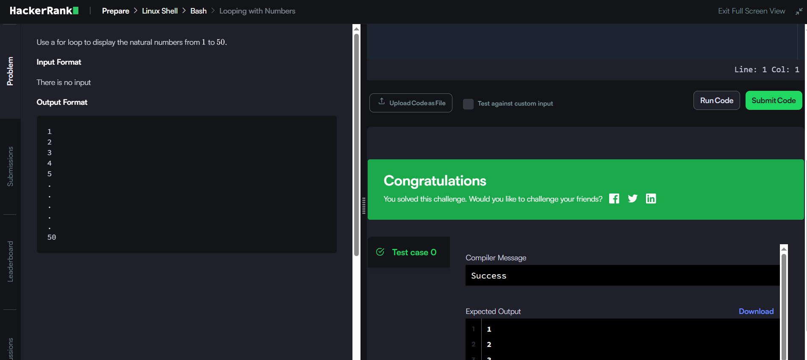
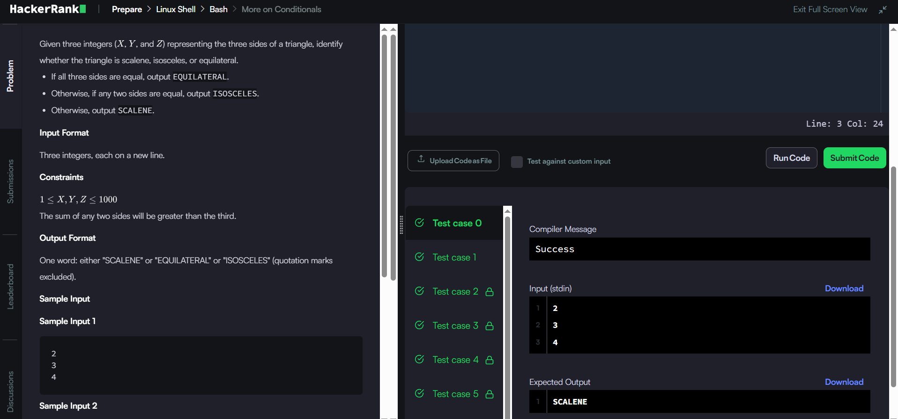
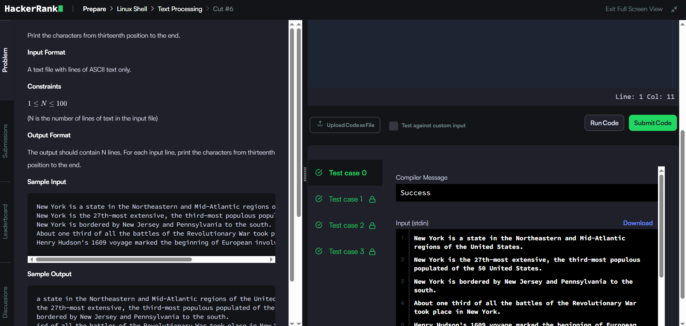
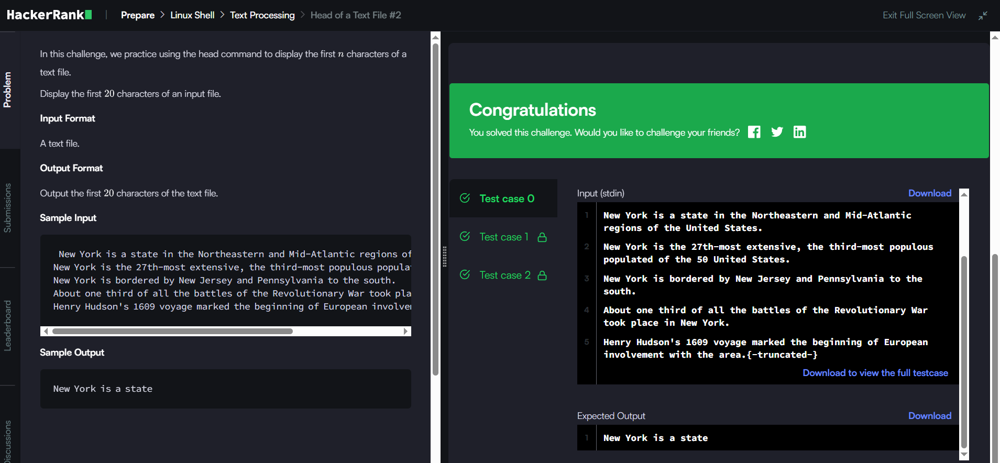
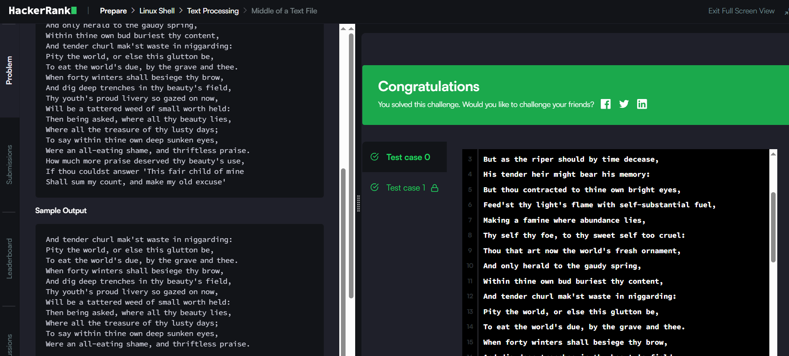
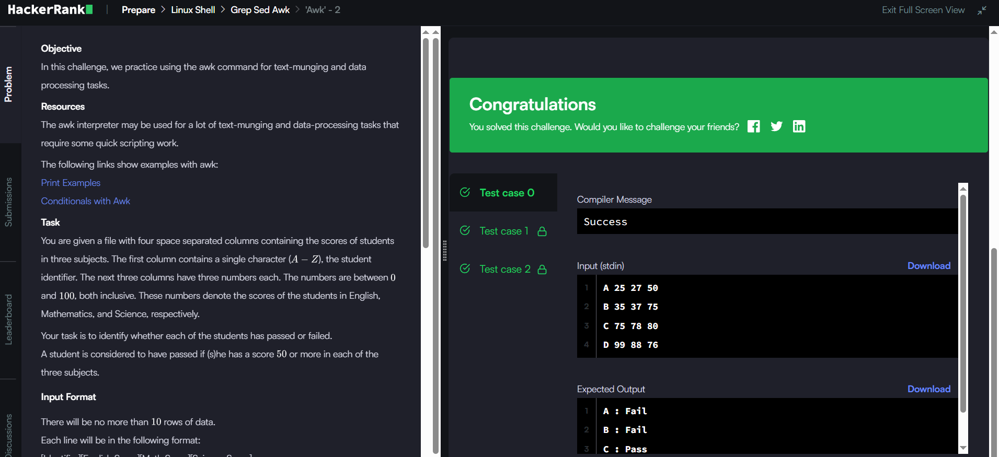

# HACKERRANK
# BASH

## Let's Echo

~~~
echo "HELLO"
~~~

## Looping and Skipping

~~~
for ITERATOR in {1..99}; do
    if [[ $((ITERATOR % 2)) -eq 1 ]]; then
        echo $ITERATOR
    fi
done
~~~

## A Personalized Echo

~~~
read name
echo "Welcome $name"
~~~

## Looping with Numbers

~~~
for i in {1..50}
do 
   echo $i
done
~~~

## The World of Numbers

~~~
read X
read Y

echo "$(( $X + $Y ))"
echo "$(( $X - $Y ))"
echo "$(( $X * $Y ))"
echo "$(( $X / $Y ))"

~~~

## Comparing Numbers

~~~
read X
read Y

if (( $X < $Y )); then
    echo 'X is less than Y'
elif (( $X > $Y )); then
    echo 'X is greater than Y'
else
    echo 'X is equal to Y'
fi
~~~

## Getting started with conditionals

~~~
read char

if [[("$char" == 'y' || "$char" == 'Y')]]
then
echo "YES"
elif [[("$char" == 'n' || "$char" == 'N')]]
then
echo "NO"
fi
~~~

## More on Conditionals

~~~
read X; read Y; read Z;
if [ $X -eq $Y ] && [ $Y -eq $Z ]; then echo "EQUILATERAL";
elif [ $X -ne $Y ] && [ $X -ne $Z ] && [ $Y -ne $Z ]; then echo "SCALENE";
else echo "ISOSCELES"; fi
~~~

## Arithmetic Operations

~~~
read line;
printf "%.3f" $(echo "scale = 4; $line" | bc);
~~~

## Compute the Average

~~~
sum=0
read N

for i in $(seq 1 $N); do
    read number
    sum=$(( $sum + $number ))
done

printf "%.3f\n" `echo "$sum / $N" | bc -l`
~~~

## Functions and Fractals - Recursive Trees - Bash!

~~~
declare -A a

f() {
    local d=$1 l=$2 r=$3 c=$4
    [[ $d -eq 0 ]] && return
    for ((i=l; i; i--)); do
        a[$((r-i)).$c]=1
    done
    ((r -= l))
    for ((i=l; i; i--)); do
        a[$((r-i)).$((c-i))]=1
        a[$((r-i)).$((c+i))]=1
    done
    f $((d-1)) $((l/2)) $((r-l)) $((c-l))
    f $((d-1)) $((l/2)) $((r-l)) $((c+l))
}
read n
f $n 16 63 49
for ((i=0; i<63; i++)); do
    for ((j=0; j<100; j++)); do
        if [[ ${a[$i.$j]} ]]; then
            printf 1
        else
            printf _
        fi
    done
    echo
done
~~~

## Cut #1

~~~
cut -c 3
~~~

## Cut #2

~~~
cut -c 2,7
~~~

## Cut #3

~~~
cut -c 2-7
~~~

## Cut #4

~~~
cut -c -4
~~~

## Cut #5

~~~
cut -f 1-3
~~~

## Cut #6

~~~
cut -c 13-
~~~

## Cut #7

~~~
cut -d " " -f 4
~~~

## Cut #8

~~~
cut -d " " -f 1-3
~~~

## Cut #9

~~~
cut -f 2-
~~~

## Head of a Text File #1

~~~
head -20
~~~

## Head of a Text File #2

~~~
head -c 20
~~~

## Middle of a Text File

~~~
head -22 | tail -11
~~~

## Tail of a Text File #1

~~~
tail -20
~~~

## Tail of a Text File #2

~~~
tail -c 20
~~~

## 'Tr' Command #1

~~~
tr "()" "[]"
~~~

## 'Tr' Command #2

~~~
tr -d "a-z"
~~~

## 'Tr' Command #3

~~~
tr -s ' '
~~~

## Sort Command #1

~~~
sort
~~~

## Sort Command #2

~~~
sort -r
~~~

## Sort Command #3

~~~
sort -n
~~~

## Sort Command #4

~~~
sort -n -r
~~~

## Sort Command #5

~~~
sort -k2 -n -r -t$'\t'
~~~

## Sort Command #6

~~~
sort -n -k2 -t$'\t'
~~~

## 'Sort' command #7

~~~
sort -k2 -n -r -t '|'
~~~

## 'Uniq' Command #1

~~~
uniq
~~~

## 'Uniq' Command #2

~~~
uniq -c | cut -c7- 
~~~

## 'Uniq' command #3

~~~
uniq -i -c | cut -c7-
~~~

## 'Uniq' command #4

~~~
uniq -u
~~~

## Paste - 3

~~~
paste -s 
~~~

## Paste - 4

~~~
paste - - -
~~~

## Paste - 1

~~~
paste -d";" -s
~~~

## Paste - 2

~~~
paste -d ";" - - -
~~~

## Read in an Array

~~~
while read line
do
    arr=(${arr[@]} $line)
done

echo ${arr[@]}
~~~

## Slice an Array

~~~
arr=($(cat))
echo ${arr[@]:3:5}
~~~

## Filter an Array with Patterns

~~~
while read word; do
    array=(${array[*]} $word)
done

for var in ${array[*]}; do
    if echo $var | grep 'A' > /dev/null ; then
        continue
    elif echo $var | grep 'a'> /dev/null; then 
        continue
    else
        echo $var
    fi
done
~~~

## Concatenate an array with itself

~~~
array=($(cat))
array3=("${array[@]}" "${array[@]}" "${array[@]}")
echo ${array3[@]}
~~~

## Display an element of an array

~~~
array=($(cat))
echo ${array[3]}
~~~

## Count the number of elements in an Array

~~~
array=($(cat))
echo ${#array[@]}
~~~

## Remove the First Capital Letter from Each Element

~~~
while read line
do 
    first_character=${line:0:1}
    rest_of_characters=${line:1}
    if [[ ${line} =~ [A-Z] ]]
    then
        new_line=$(echo "$first_character" | tr '[:upper:]' '.')
        line=$new_line$rest_of_characters
    fi
    myArray=(${myArray[@]} $line)
done

echo ${myArray[@]}
~~~

## Lonely Integer - Bash!

~~~
read
arr=($(cat)) 
echo "${arr[@]}" | tr ' ' '\n' |sort | uniq -u | tr '\n' ' '
~~~

## 'Awk' - 3

~~~
awk '{ total=$2+$3+$4; avg=total/3; print $0 " : " (avg > 50 ? avg > 60 ? avg > 80 ? "A" : "B" : "C" : "FAIL"); }'
~~~

## 'Awk' - 4

~~~
awk 'END{ if((NR%2)) print p ";" }!(NR%2){ print p ";" $0 }{ p = $0 }'
~~~

## 'Grep' #1

~~~
grep -w "the"
~~~

## 'Grep' #2

~~~
grep -iw "the"
~~~

## 'Grep' #3

~~~
grep -iv "that"
~~~

## 'Grep' - A

~~~
grep -iwe "the\|that\|then\|those"
~~~

## 'Grep' - B

~~~
grep '\([0-9]\) *\1'
~~~

## 'Sed' command #1

~~~
sed -e 's/the /this /1'
~~~

## 'Sed' command #2

~~~
sed -e 's/thy /your /gI'
~~~

## 'Sed' command #3

~~~
sed -e 's/thy/{&}/gI'
~~~

## 'Sed' command #4

~~~
sed -r 's/[0-9]{4}[ ]/**** /g'
~~~

## 'Sed' command #5

~~~
sed -E 's/([0-9]{4}) ([0-9]{4}) ([0-9]{4}) ([0-9]{4})/\4 \3 \2 \1 /g' 
~~~

## 'Awk' - 1

~~~
awk '{ if(length($4) == 0) print "Not all scores are available for " $1 }'
~~~

## 'Awk' - 2

~~~
awk '{ print $1 ($2 < 50 || $3 < 50 || $4 < 50 ? " : Fail" : " : Pass") }'
~~~